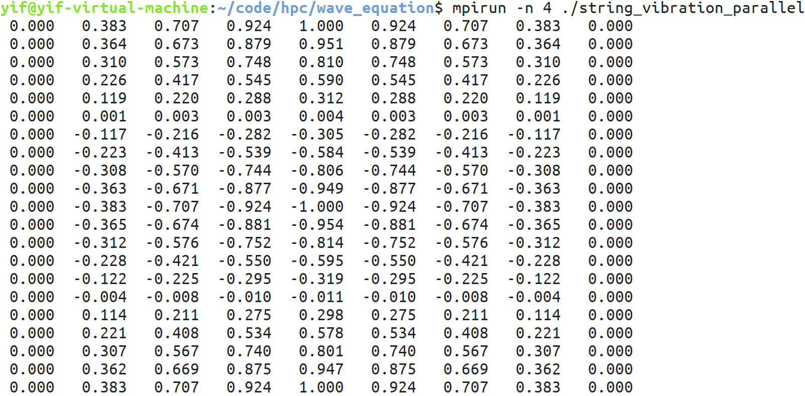

# HPC-with-MPI

## 弦振动问题

### 文件结构

- `string_vibration` 
  - `out.png`运行结果截图
  - `string_vibrtion_parallel.c`程序源码
  - `string_vibration_parallel`可执行文件

### 方案简介

列分块并行，仅支持多进程运行（2个及以上进程）。块宽度自适应用户定义进程数，每块宽度可不等长：每个处理器首先分到问题规模整除进程数得到的列数，剩余列追加到掌握0号进程的处理器中参与运算。通信采用单层Ghost Layer,即一层计算一步通信的方式。

### 运行方式

```shell
cd ./string_vibration
mpicc ./string_vibration_parallel.c -o string_vibration_parallel -lm #编译
mpirun -n 4 ./string_vibration_parallel #运行
```

### 结果呈现




## 热传导问题

### 文件结构

- `thermal_equation` 热传导问题求解程序
  - `src`源码目录
    - `meshdef.h`网格定义头文件
    - `2DThermal.cpp`求解器主程序
    - `solver_parallel.cpp`主程序所调用的并行求解函数
    - `solver_serial.cpp`主程序所调用的串行求解函数
    - `output_vtk.cpp`数据转vtk文件输出函数
  - `out`输出结果文件夹
    -  `thermal.vtk`数据文件
    - `screenshot.png`绘图结果
  - `build`编译文件目录
    - `./solver`为二进制可执行文件

### 方案简介

列分块并行，支持单、多进程运行（当用户传入进程数为1时调用原始提供的串行求解器，否则调用并行求解器）。块宽度自适应用户定义进程数，每块宽度可不等长：每个处理器首先分到问题规模整除进程数得到的列数，剩余列追加到掌握0号进程的处理器中参与运算。

### 运行方式

```shell
cd ./thermal_equation/build
make #编译
mpirun -n 4 ./solver #运行
```

### 结果呈现


## 前台阶流动模拟

### 文件结构

- `CFD` 前台阶流动数值模拟程序
  - `src`源码目录
    - `util.h`工具函数定义头文件
    - `miniCFD.cpp`求解器主程序
    - `util.cpp`工具函数集合
  - `out`输出结果文件夹（vtk文件序列体积过大没有提供）
    - `animation.gif`模拟动图
    - `animation.mov`模拟动画
  - `build`编译文件目录
    - `./solver`为二进制可执行文件

### 方案简介

选用Steger Warming通量分裂法、WENO差分格式。

棋盘式分块并行。在符合物理定律并存在数学解的情况下，程序输入的模拟边框长宽以及台阶角点坐标等几乎所有参数皆可为自由定义值，无任何限制，程序将针对定义的空间步长对网格点做自动吸附操作；当问题规模不至于过小的情况下理论支持任意进程数运行，程序将以进程数对棋盘式划分做出决策（例如：输入进程数为8，则将对网格做2行×4列的棋盘式分块划分），为保持每块棋盘中数据维度一致，将舍弃网格点数的整除求余部分，因此在不同进程数运行时输出结果的网格长宽可能会有微小差别，对于正常规模的问题可以忽略不计。

采用MPI+OpenMP混合编程。以MPI为基础，OpenMP针对无复杂依赖的简单单层循环进行优化，默认为关闭状态，针对实际情况可开启后编译运行。

### 运行方式

所有传入参数可进入`util.h`头文件定义段中自定义修改，其中可以选择开启OpenMP编译运行。

```shell
cd ./CFD/build
make #编译
mpirun -n 6 ./solver #运行
```

### 结果呈现

网格分辨率取200×600，时间步长取0.00005，使用paraview绘制。


